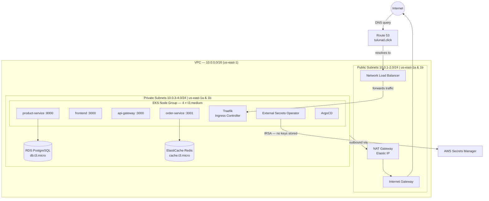
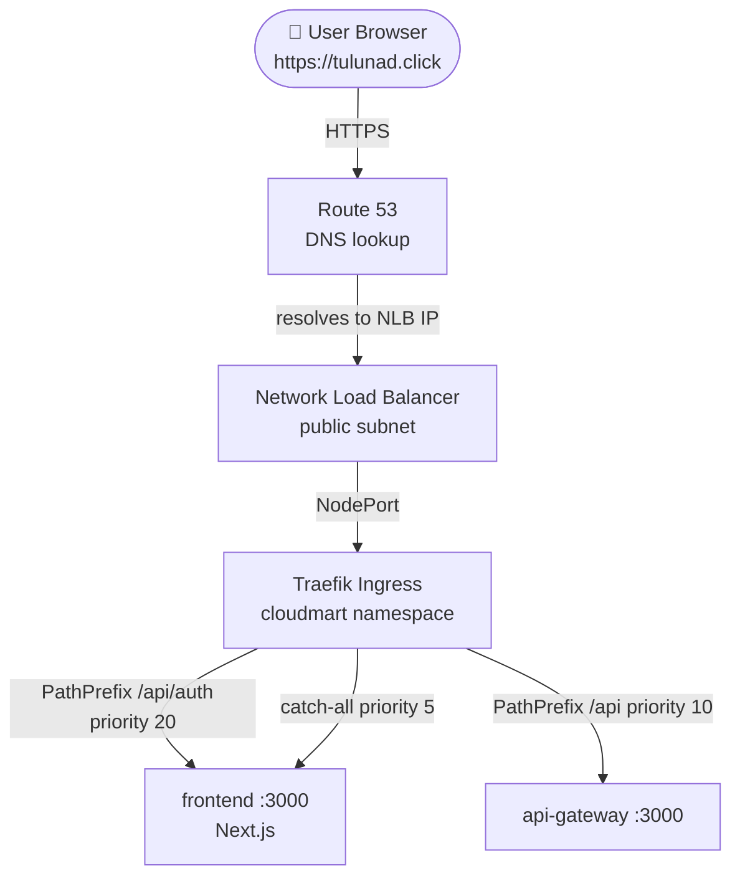
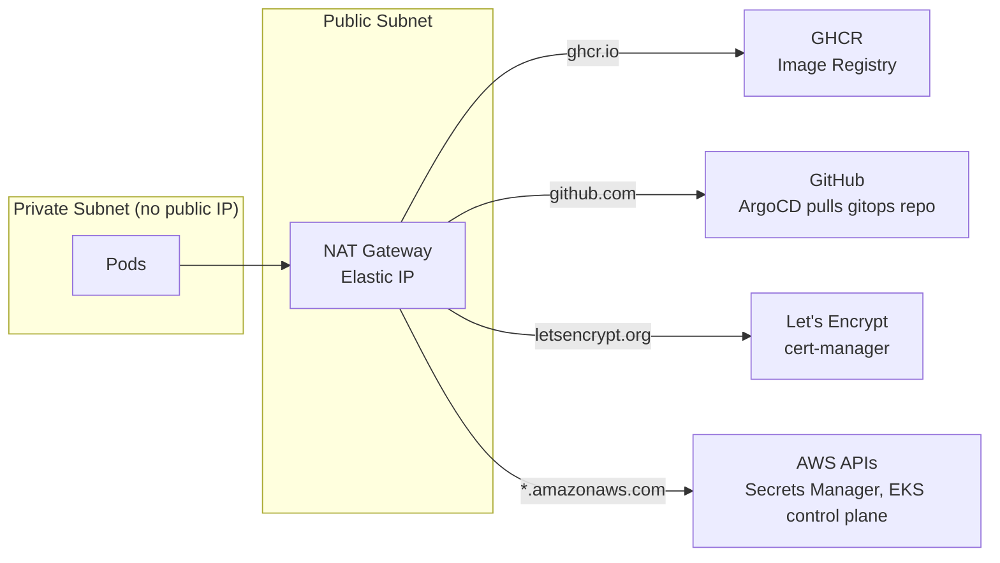
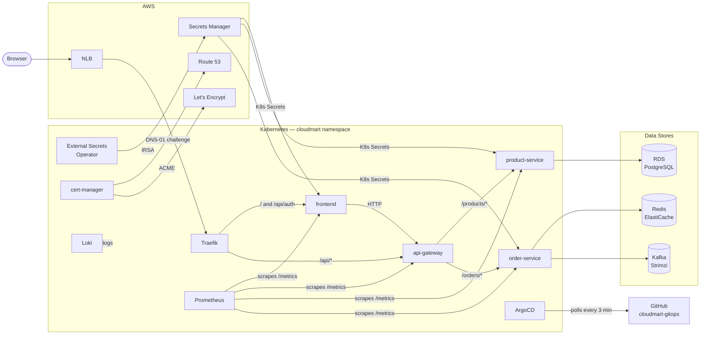
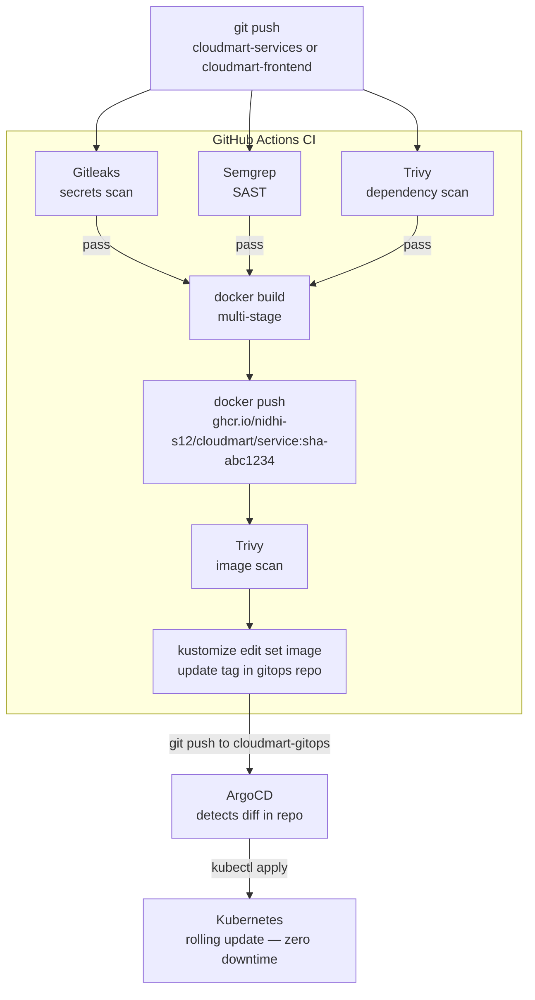
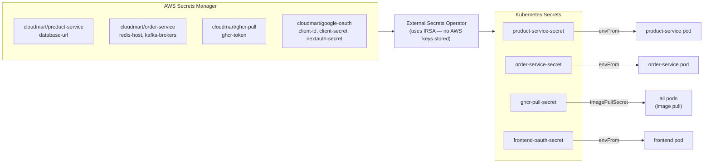
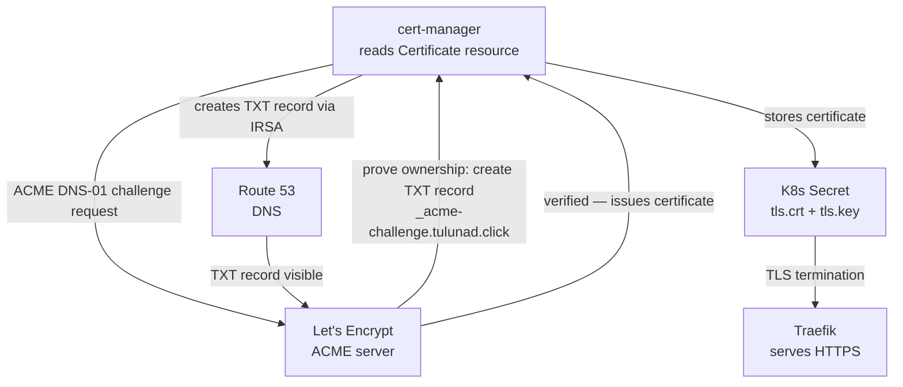

# CloudMart GitOps


Infrastructure-as-Code and Kubernetes manifests for the CloudMart e-commerce platform. This repo is the single source of truth for everything running on AWS — from the VPC and EKS cluster to application deployments.

**Live at:** `https://tulunad.click`

---

## Repositories

| Repo | Purpose |
|------|---------|
| [cloudmart-gitops](https://github.com/Nidhi-S12/cloudmart-gitops) | This repo — Terraform, Helm values, K8s manifests, ArgoCD config |
| [cloudmart-services](https://github.com/Nidhi-S12/cloudmart-services) | Backend microservices (Node.js + Python) |
| [cloudmart-frontend](https://github.com/Nidhi-S12/cloudmart-frontend) | Next.js frontend |

---

## AWS Architecture



### Subnet design

| Subnet | CIDR | What lives here | Internet access |
|--------|------|-----------------|-----------------|
| Public 1a/1b | 10.0.1-2.0/24 | NLB, NAT Gateway | Direct via Internet Gateway |
| Private 1a/1b | 10.0.3-4.0/24 | EKS nodes, RDS, ElastiCache | Outbound only via NAT |

**Why private subnets?** Nodes, RDS, and ElastiCache have no public IPs — completely unreachable from the internet directly. Traffic reaches pods only via NLB → Traefik.

**Why two AZs?** Subnets are mirrored across `us-east-1a` and `us-east-1b`. If one AZ goes down the cluster keeps running.

---

## Network Traffic Flow

### Inbound — user visiting the site



> The `/api/auth` rule has higher priority than `/api` so NextAuth OAuth callbacks always reach the frontend, not the api-gateway. Without this, Google sign-in returns 404.

### Outbound — pods reaching the internet



---

## API Interaction Map



---

## GitOps Deployment Flow



---

## Secrets Flow



---

## TLS Certificate Flow



> DNS-01 challenge is used instead of HTTP-01 because it works before the cluster is publicly reachable — cert-manager can provision the certificate during cluster bootstrap.

---

## Kubernetes Platform Stack

| Component | Namespace | Why it's here |
|-----------|-----------|---------------|
| **Metrics Server** | kube-system | Provides CPU/memory metrics — required for HPA to work |
| **Traefik** | cloudmart | Ingress controller — routes HTTPS traffic, terminates TLS |
| **Strimzi** | cloudmart | Kafka operator — manages the Kafka cluster for order events |
| **ArgoCD** | argocd | GitOps engine — watches this repo, applies changes to cluster |
| **Prometheus + Grafana** | monitoring | Metrics collection and dashboards |
| **Loki** | monitoring | Log aggregation — all pod logs queryable from Grafana |
| **Kyverno** | kyverno | Policy enforcement — no latest tags, no root containers |
| **cert-manager** | cert-manager | Auto-provisions and renews Let's Encrypt TLS certificates |
| **External Secrets Operator** | cloudmart | Syncs secrets from AWS Secrets Manager into K8s Secrets |

---

## Application Services

| Service | Language | Port | Backing store |
|---------|----------|------|---------------|
| frontend | Next.js 14 | 3000 | — |
| api-gateway | Node.js / Express | 3000 | — |
| product-service | Python / FastAPI | 8000 | RDS PostgreSQL |
| order-service | Node.js / Express | 3001 | ElastiCache Redis + Kafka |

---

## Autoscaling

All 4 services have a HorizontalPodAutoscaler backed by Metrics Server:

| Service | Min | Max | Scale trigger |
|---------|-----|-----|---------------|
| frontend | 1 | 4 | CPU > 70% or Memory > 80% |
| api-gateway | 1 | 4 | CPU > 70% or Memory > 80% |
| product-service | 1 | 4 | CPU > 70% or Memory > 80% |
| order-service | 1 | 4 | CPU > 70% or Memory > 80% |

Scale-down has a 5-minute stabilisation window to avoid flapping.

---

## Policy Enforcement (Kyverno)

| Policy | Rule |
|--------|------|
| `disallow-latest-tag` | Image tag must be pinned (e.g. `sha-abc1234`) — `latest` is non-deterministic |
| `disallow-root-user` | Containers must run as a non-root user |
| `require-probes` | Liveness and readiness probes must be defined |
| `require-resource-limits` | CPU and memory limits must be set |

---

## Monitoring & Alerting

| Alert | Fires when |
|-------|-----------|
| `PodCrashLooping` | Any pod is in CrashLoopBackOff |
| `PodImagePullFailed` | Any pod is in ImagePullBackOff |
| `HighCPUUsage` | Pod CPU > 85% for 5 minutes |
| `HighMemoryUsage` | Pod memory > 90% for 5 minutes |
| `HPAAtMaxReplicas` | Any HPA is at its replica ceiling |
| `HPAScalingLimited` | HPA wants to scale but is throttled |
| `KafkaUnderReplicatedPartitions` | Kafka partition has fewer replicas than expected |
| `KafkaConsumerGroupLag` | Consumer group is falling behind |

---

## Repo Structure

```
cloudmart-gitops/
├── terraform/
│   ├── environments/production/    # Root module
│   │   ├── main.tf                 # Wires all modules together
│   │   ├── variables.tf
│   │   ├── outputs.tf
│   │   └── terraform.tfvars        # NOT in git — contains db_password
│   └── modules/
│       ├── vpc/                    # VPC, subnets, IGW, NAT, route tables
│       ├── eks/                    # EKS cluster + managed node group
│       ├── rds/                    # PostgreSQL (private subnet)
│       ├── elasticache/            # Redis (private subnet)
│       └── s3/
├── base/                           # K8s manifests — environment-agnostic
│   ├── frontend/                   # Deployment, Service, HPA
│   ├── api-gateway/
│   ├── product-service/
│   ├── order-service/
│   ├── kafka/                      # Strimzi KafkaNodePool + Kafka CRs
│   └── external-secrets/           # SecretStore + ExternalSecrets
├── environments/
│   ├── production/                 # Kustomize overlay — pinned image tags
│   │   ├── kustomization.yaml      # Updated by CI on every deploy
│   │   └── patches/
│   └── local/                      # Kustomize overlay — local dev
├── argocd/apps/
│   └── services/cloudmart-production.yaml
└── infrastructure/
    ├── setup.sh                    # Full cluster bootstrap script
    ├── cert-manager/
    ├── traefik/values.yaml
    ├── kafka/values.yaml
    ├── kyverno/
    └── monitoring/                 # prometheus-values.yaml, loki-values.yaml, alert-rules.yaml
```

---

## Spinning Up the Cluster

### Prerequisites
- AWS CLI configured, Terraform ≥ 1.5, kubectl, helm, kustomize
- Domain in Route 53 with a hosted zone

### 1 — Provision AWS infrastructure

```bash
cd terraform/environments/production
echo 'db_password = "YourSecurePassword"' > terraform.tfvars
terraform init
terraform apply
```

### 2 — Configure kubectl

```bash
aws eks update-kubeconfig --region us-east-1 --name cloudmart-production
```

### 3 — Create secrets in AWS Secrets Manager

```bash
# Use RDS and ElastiCache endpoints from: terraform output

aws secretsmanager create-secret --name cloudmart/product-service --region us-east-1 \
  --secret-string '{"database-url":"postgresql+asyncpg://cloudmart:<password>@<rds-endpoint>:5432/cloudmart"}'

aws secretsmanager create-secret --name cloudmart/order-service --region us-east-1 \
  --secret-string '{"redis-host":"<elasticache-endpoint>","kafka-brokers":"cloudmart-kafka-kafka-bootstrap.cloudmart.svc.cluster.local:9092"}'

aws secretsmanager create-secret --name cloudmart/ghcr-pull --region us-east-1 \
  --secret-string '{"ghcr-token":"<github-pat>"}'

aws secretsmanager create-secret --name cloudmart/google-oauth --region us-east-1 \
  --secret-string '{"client-id":"<id>","client-secret":"<secret>","nextauth-secret":"<random-32-chars>"}'
```

### 4 — Bootstrap the cluster

```bash
cd infrastructure/
./setup.sh
```

### Tear Down

```bash
cd terraform/environments/production
terraform destroy

# Secrets are not managed by Terraform — delete manually:
for secret in cloudmart/product-service cloudmart/order-service cloudmart/ghcr-pull cloudmart/google-oauth; do
  aws secretsmanager delete-secret --secret-id $secret --region us-east-1 --force-delete-without-recovery
done
```

---

## Accessing Services

```bash
# Grafana
kubectl port-forward svc/kube-prometheus-stack-grafana 3000:80 -n monitoring
# → http://localhost:3000  (admin / cloudmart123)

# ArgoCD
kubectl port-forward svc/argocd-server 8080:80 -n argocd
# → http://localhost:8080
kubectl get secret argocd-initial-admin-secret -n argocd -o jsonpath='{.data.password}' | base64 -d

# Prometheus
kubectl port-forward svc/kube-prometheus-stack-prometheus 9090:9090 -n monitoring
# → http://localhost:9090
```
